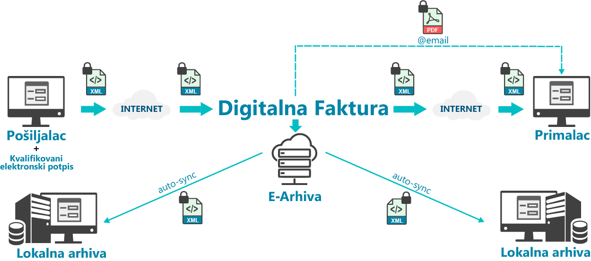

============================================================================
DigitalnaFaktura
============================================================================

Šta je to digitalna faktura (e-faktura)

Generalno, fakturom (u širokoj upotrebi je i termin „račun“) se smatra formalni dokument koji kupcu izdaje prodavac/dobavljač, a kojim se zahteva plaćanje za prodaju robe ili pružanje usluga. Stoga je faktura dokument od suštinske važnosti za trgovinske partnere, lanac snabdevanja, računovodstvo i naravno poreske organe. 

.. toctree::
   :maxdepth: 2
   :caption: Digitalna Faktura
   :name: sek-digitalnafaktura

   Stranice/demo
   
.. toctree::
   :maxdepth: 2
   :caption: Faktura
   :name: sek-strukturalnafaktura

   Stranice/StrukturalnaFaktura

